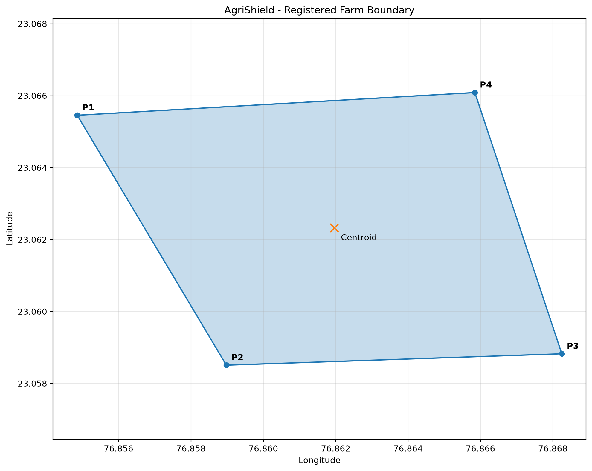
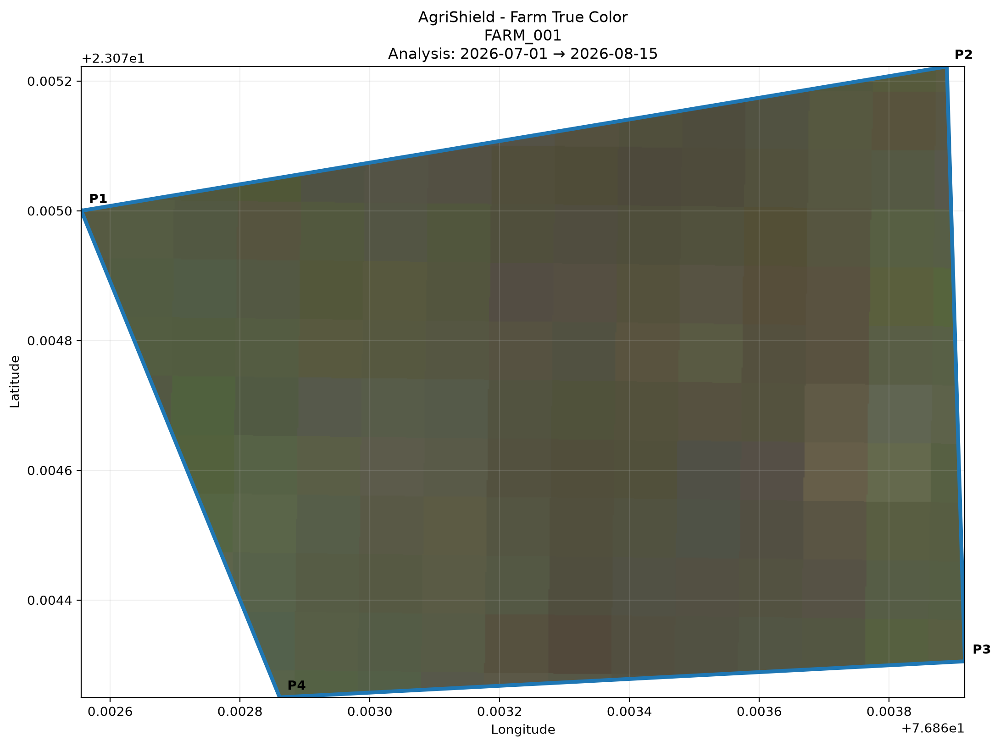
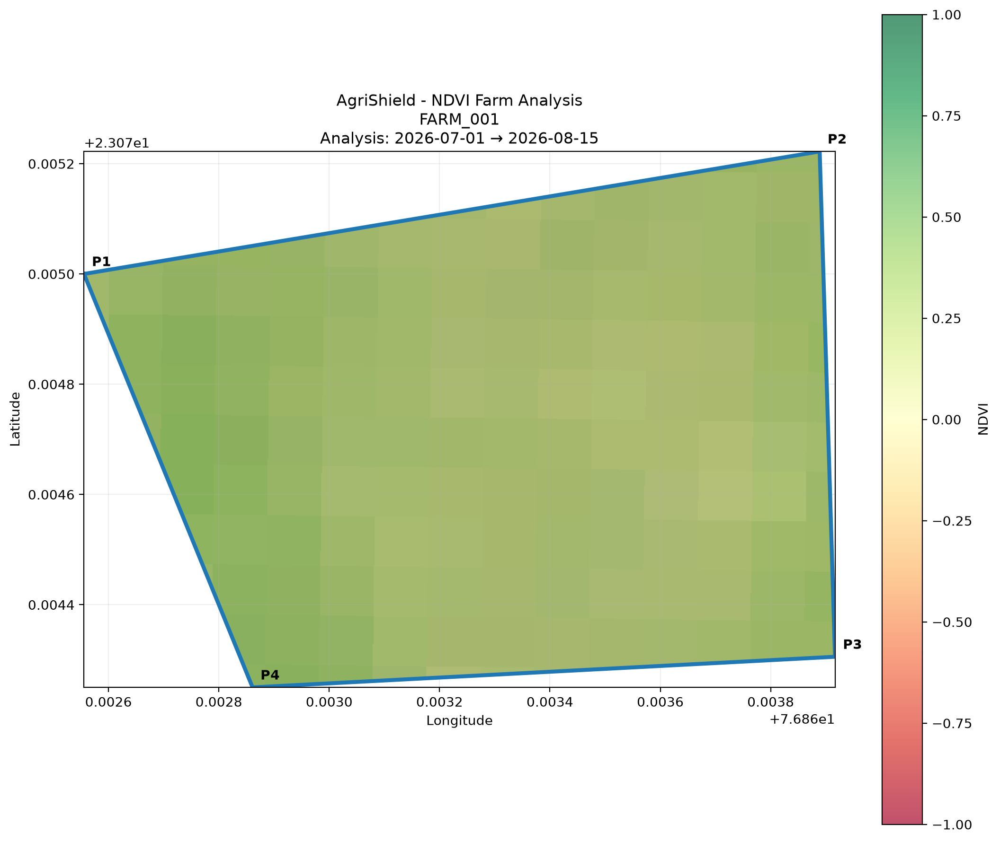
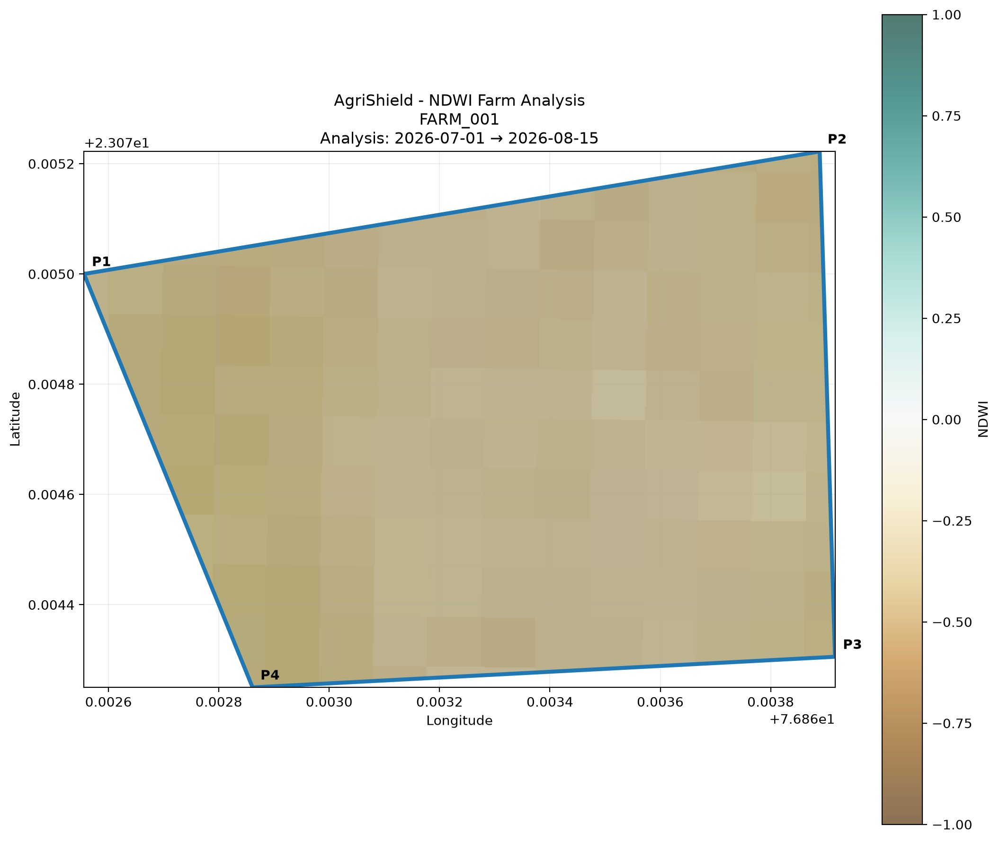
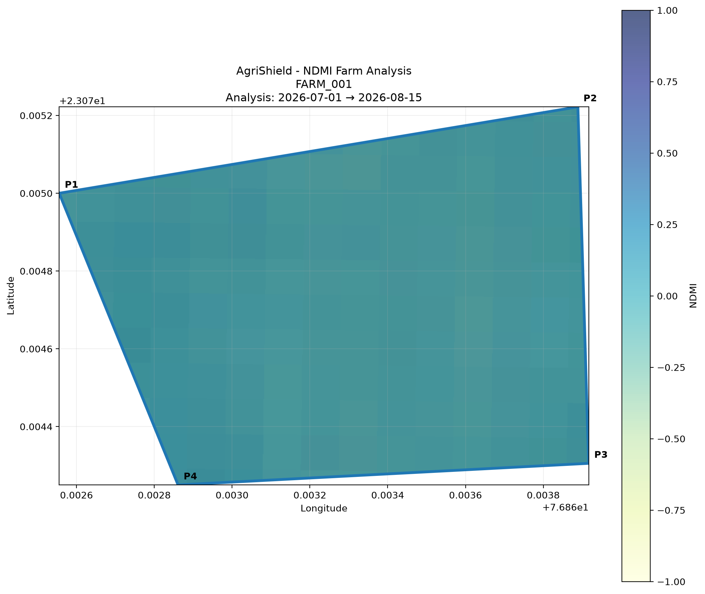

# Agrishield-AI

Agrishield-AI is a comprehensive farm analysis tool that registers farm boundaries, collects satellite imagery to analyze crop health and moisture indices, and fetches real-time soil and weather data. 

## Project Workflow & Steps

The pipeline is divided into distinct collection steps, all driven by Python scripts.

### 1. Farm Registration
**Script**: `collection/farm/Farmer.py`

**Description**: 
This script takes boundary coordinates (Latitude, Longitude) for a farm, validates them, and constructs a geometric polygon. It computes the area, perimeter, centroid, and bounding box of the farm. 

**Output Received**:
- `data/processed/farm/farm.json`: Contains the geometric details, area, perimeter, and centroid.
- `data/processed/farm/farm_boundary.png`: A visual map plot of the farm's boundary.

**Farm Boundary Output:**


---

### 2. Satellite Imagery & Index Analysis
**Script**: `collection/satellite/SatelliteCollector.py`

**Description**:
Using the boundary data from `farm.json`, this script interacts with the Copernicus Sentinel-2 API to fetch satellite imagery. It performs remote sensing calculations to generate key agricultural indices:
- **NDVI** (Normalized Difference Vegetation Index): Measures plant health and density.
- **NDWI** (Normalized Difference Water Index): Assesses water content in vegetation/soil.
- **NDMI** (Normalized Difference Moisture Index): Monitors moisture stress in crops.

**Output Received**:
- `data/processed/satellite/output/analysis_summary.json`: Statistical summary of the computed indices.
- `data/processed/satellite/output/sentinel_raw.tif`: The raw multispectral image.
- GeoTIFF files for indices: `ndvi.tif`, `ndwi.tif`, `ndmi.tif`
- **Visual Overlays**: PNG images showing the farm with true color and index heatmaps.

**Satellite Visual Outputs:**

*True Color Image:*


*NDVI (Vegetation Health) Overlay:*


*NDWI (Water Content) Overlay:*


*NDMI (Moisture Index) Overlay:*


---

### 3. Soil Data Collection
**Script**: `collection/satellite/soil.py`

**Description**:
Leverages the SoilHive API. It converts the farm polygon into Well-Known Text (WKT) format and requests global soil dataset information tailored to the specific farm boundary.

**Output Received**:
- `data/processed/soil/soil_data.json`: Standardized JSON containing soil properties (e.g., pH, organic carbon, texture) mapped to the farm location.

---

### 4. Weather Data Collection
**Script**: `collection/satellite/weather.py`

**Description**:
Fetches recent and forecasted weather data for the farm's centroid location to aid in agronomic decision-making.

**Output Received**:
- `data/processed/weather/weather.json`: JSON output containing metrics such as temperature, precipitation, and humidity.

---

## Setup & Installation

1. Ensure you have Python installed.
2. Install the required dependencies:
   ```bash
   pip install -r requirements.txt
   ```
3. Configure your Environment Variables by creating a `.env` file in the root directory:
   ```env
   SOILHIVE_TOKEN=your_soilhive_api_token
   COPERNICUS_CLIENT_ID=your_copernicus_client_id
   COPERNICUS_CLIENT_SECRET=your_copernicus_client_secret
   ```
4. Run the pipeline in the order described above to generate the full suite of agricultural insights!
